# 智能财富管家系统 — 项目架构文档

> 版本: V1.0 | 更新: 2026-07-22 | 框架: FastAPI + SQLAlchemy + LangChain

---

## 一、系统总览架构图

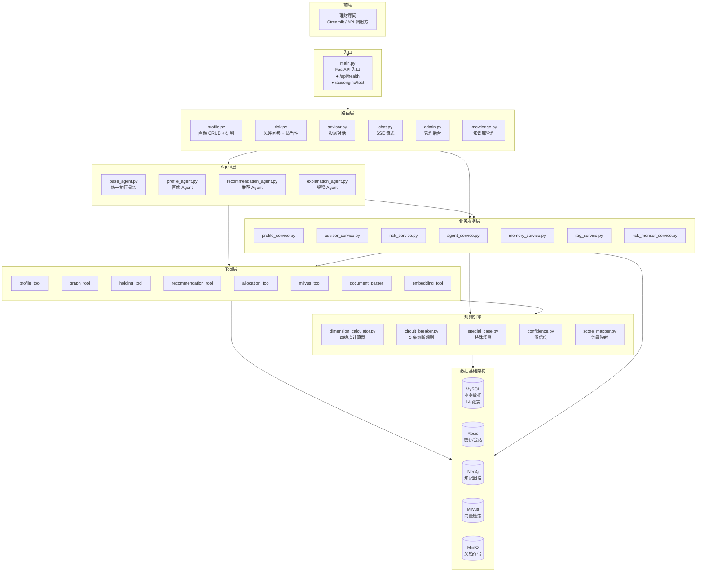

---

## 二、分层架构详解

### 2.1 上层：请求入口 → Agent 编排 → 业务服务

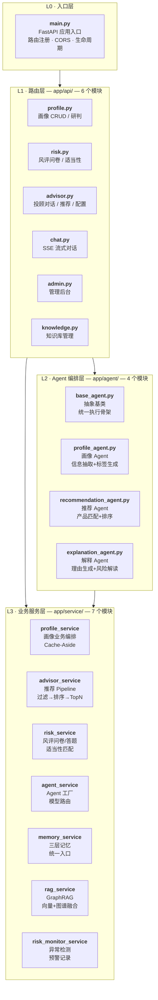

### 2.2 下层：规则引擎 → Tool 工具 → 数据基础架构

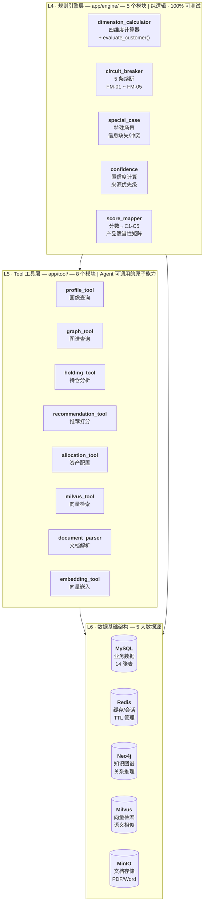

### 2.3 跨层调用关系

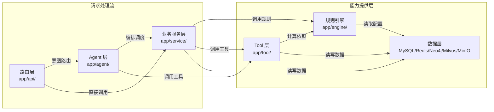

---

## 三、数据流转核心链路

### 3.1 画像研判链路（最核心路径）

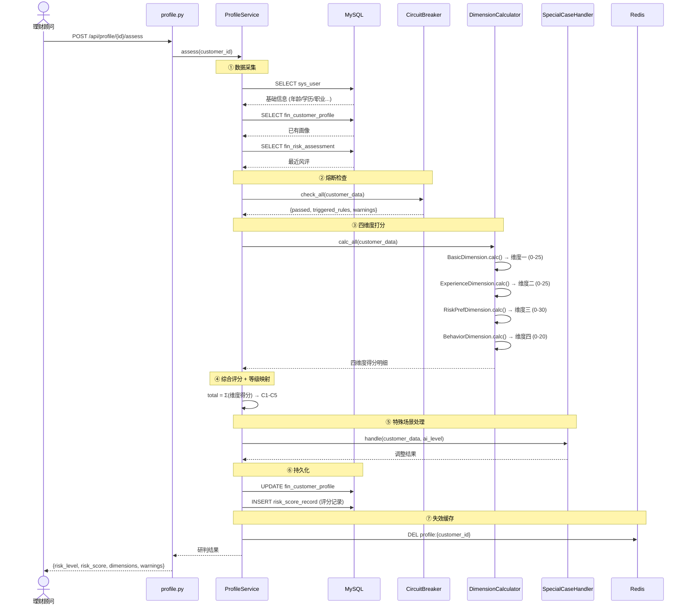

### 3.2 投顾对话链路

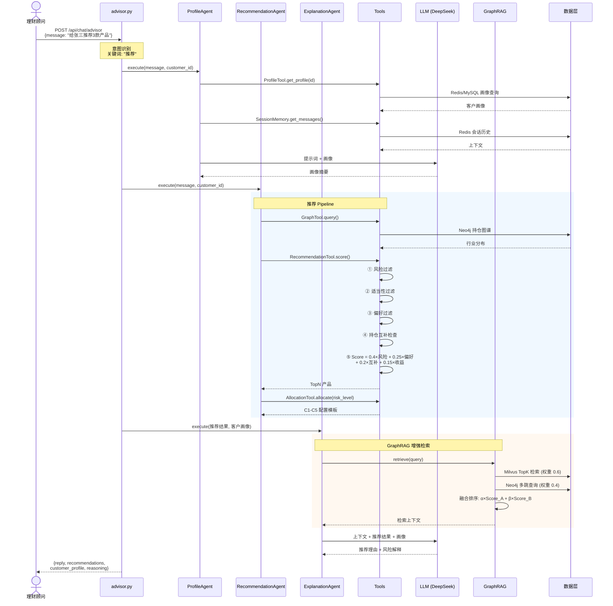

---

## 四、数据库架构

### 4.1 存储矩阵

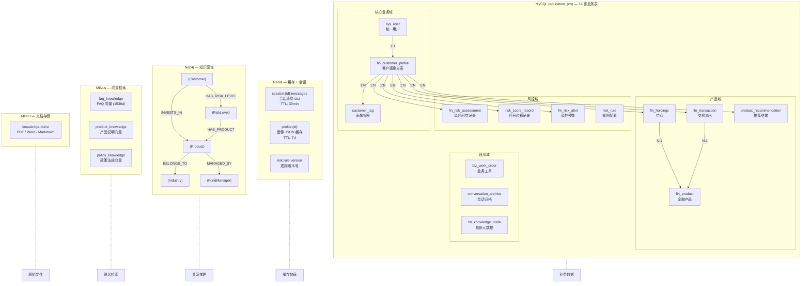

### 4.2 核心表 ER 关系

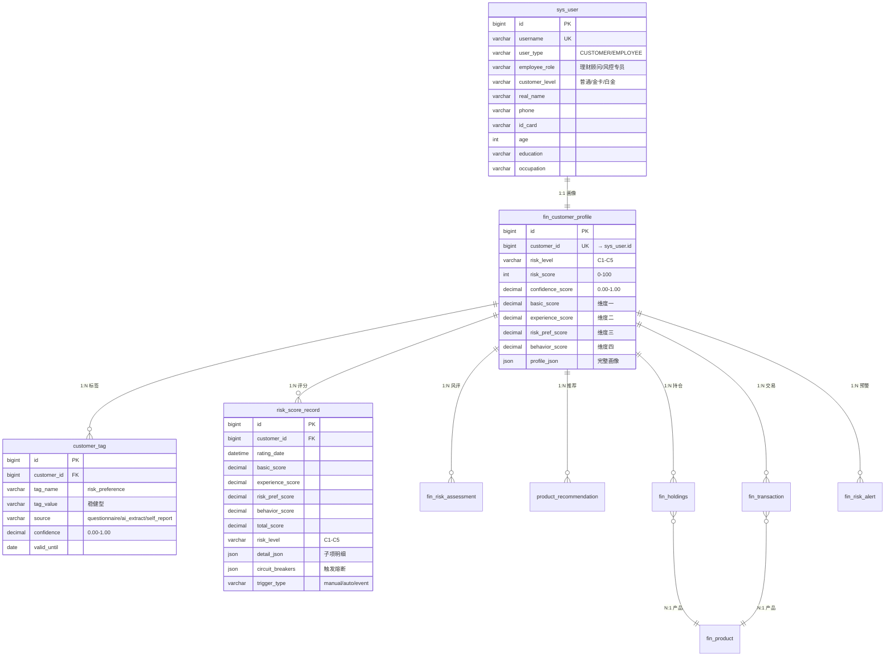

---

## 五、Memory 三层记忆架构

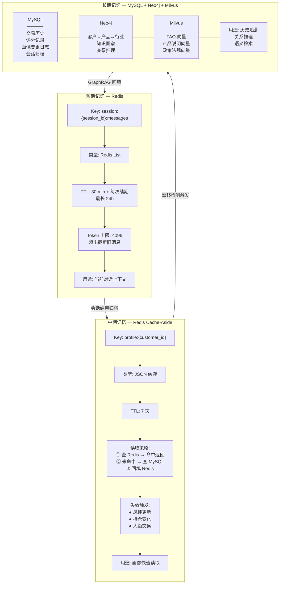

---

## 六、规则引擎架构

```mermaid
flowchart TD
    INPUT["evaluate_customer(customer_data)"]
    INPUT --> SPLIT{并行执行}

    SPLIT --> DC["DimensionCalculator<br/>四维度计算器"]
    SPLIT --> CB["CircuitBreaker<br/>5 条熔断规则"]
    SPLIT --> SM["ScoreMapper<br/>等级映射"]

    DC --> D1["BasicDimension<br/>维度一 满分25<br/>公式: Σ(5项)÷5÷10×25<br/>年龄/学历/职业/收入/资产"]
    DC --> D2["ExperienceDimension<br/>维度二 满分25<br/>公式: Σ(4项)÷4÷10×25<br/>年限/复杂度/频率/收益"]
    DC --> D3["RiskPrefDimension<br/>维度三 满分30 [0,30]<br/>公式: 风评+情绪化+亏损承受<br/>● C1→5 C2→10 C3→15<br/>● 追涨杀跌-3 恐慌赎回-5"]
    DC --> D4["BehaviorDimension<br/>维度四 满分20<br/>8种异常行为计分<br/>无异常20 任何高风险0"]

    CB --> F1["FM-01 年龄限制<br/><18禁止 >70面签 >80仅R1"]
    CB --> F2["FM-02 收入资产<br/>无收入+资产<1万→仅R1-R2"]
    CB --> F3["FM-03 风评时效<br/>>12月冻结 >6月提醒"]
    CB --> F4["FM-04 身份异常<br/>过期>90天冻结 制裁名单冻结"]
    CB --> F5["FM-05 交易熔断<br/>日亏>10% 连续大额赎回"]

    SM --> S1["综合得分 = Σ(四维度得分)<br/>满分 100"]
    S1 --> S2["等级映射<br/>0-25→C1 26-40→C2<br/>41-60→C3 61-80→C4<br/>81-100→C5"]
    S2 --> S3["产品矩阵<br/>C1→R1-R2 C2→R1-R3<br/>C3→R1-R4 C4→R1-R5<br/>C5→R1-R5"]

    D1 & D2 & D3 & D4 --> MERGE
    F1 & F2 & F3 & F4 & F5 --> MERGE
    S1 & S2 & S3 --> MERGE

    MERGE["汇总结果"]
    MERGE --> SC["SpecialCaseHandler<br/>● 信息不完整→保守下调<br/>● 自评vsAI冲突→人工复核<br/>● 特殊人群→额外限制"]
    SC --> OUTPUT["最终研判结果<br/>{passed, total_score, risk_level,<br/>dimensions, circuit_breakers,<br/>warnings, suitable_products}"]
```

---

## 七、知识库数据流

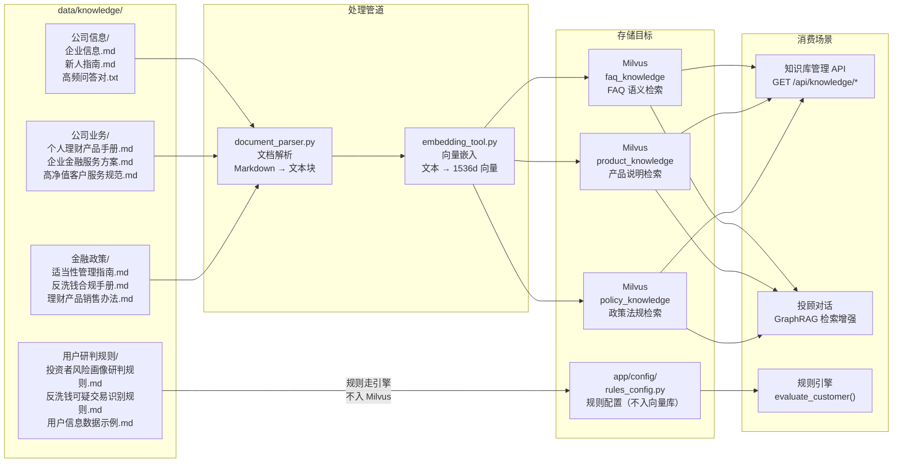

---

## 八、部署拓扑

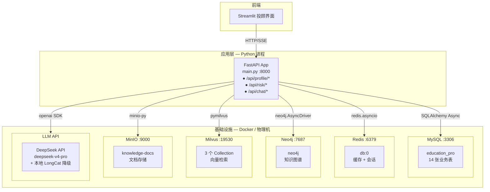

---

## 九、快速导航

| 我想... | 去这里 |
|---------|--------|
| 启动项目 | `python main.py` |
| 测试规则引擎 | `python -m app.engine.dimension_calculator` |
| 测试熔断规则 | `python -m app.engine.circuit_breaker` |
| 查看 API 文档 | 启动后访问 `http://localhost:8000/docs` |
| 修改评分规则 | `app/config/rules_config.py` |
| 修改数据库表结构 | `app/model/entities.py` → 重启自动 DDL |
| 添加新的 API 接口 | `app/api/` 新建路由 → `main.py` 注册 |
| 添加新的 Agent | `app/agent/` 继承 `BaseAgent` |
| 添加新的 Tool | `app/tool/` 新建工具类 |
| 配置数据库连接 | `.env` (MYSQL_*/REDIS_*/NEO4J_*/MILVUS_*) |
| 添加知识文档 | 放入 `data/knowledge/` → 调用 `/api/knowledge/upload` |

---

> **技术栈速查**: FastAPI | SQLAlchemy Async | Redis | Neo4j | Milvus | MinIO | LangChain | DeepSeek V4 | Pydantic Settings
