# 智能财富管家 Multi-Agent 业务流程设计

> 金融级闭环：**用户行为 → Chat Orchestrator → Router Agent → 业务 Agent → Event Bus → 订阅 Agent → Memory Manager → 用户状态变化**。
> 事件总线可落地为 Redis Stream 或 Kafka；业务事实先写 MySQL/Outbox，再投递事件，消费者以 `event_id + consumer` 幂等消费。正式风险等级仅由受控评估改变，情绪、市场、分析和反馈只形成策略信号。

## 1. 用户发起交易

**用户行为案例：**“购买 20 万元稳健型基金。”

| Agent | 职责 |
|---|---|
| 客服 Agent | 理解诉求、补全产品与金额 |
| 业务操作 Agent | 创建交易申请与确认单 |
| 风控 Agent | 适当性、额度与产品状态审核 |
| 用户画像 Agent | 消费成交事实并更新行为偏好 |

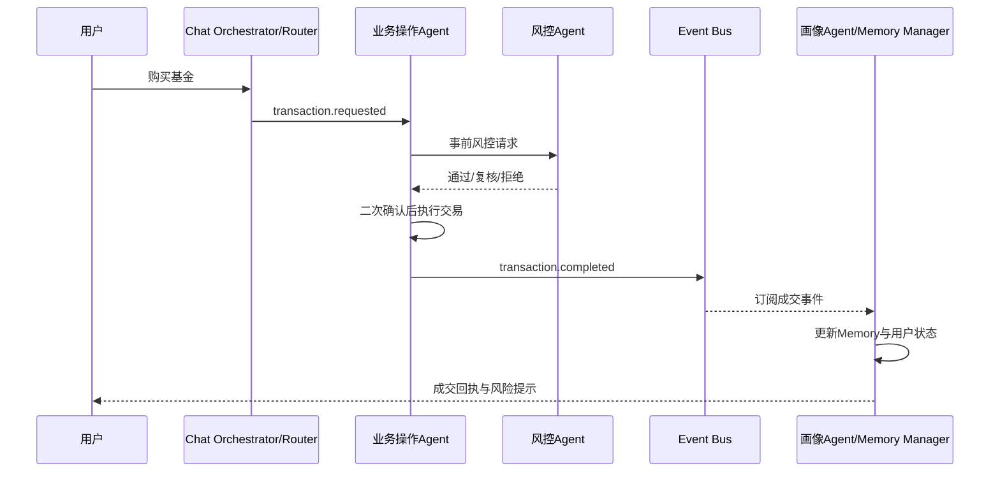

**Event 事件结构：**
```json
{"event_id":"uuid","event_type":"transaction.completed","source_agent":"business_operation","target_agent":"profile","customer_id":"C001","payload":{"product_id":"P100","amount":200000,"status":"completed"},"timestamp":"ISO-8601"}
```

**Memory 更新：**Redis 写确认上下文与会话回执；MySQL Episodic 写交易流水；MySQL Profile 写产品偏好信号；Milvus 写可检索的服务摘要；Neo4j 建立/更新 `Customer-INVESTS_IN-Product` 关系。

## 2. 大额转账风险审核

**用户行为案例：**“我要转账 50 万元。”

| Agent | 职责 |
|---|---|
| 客服 Agent | 识别大额资金操作并告知核验 |
| 业务操作 Agent | 提取收款方、金额、用途并冻结待执行单 |
| 风控 Agent | 检查金额、历史行为、账户风险与 AML 规则 |
| 安全 Agent | 核验设备、身份与登录风险 |

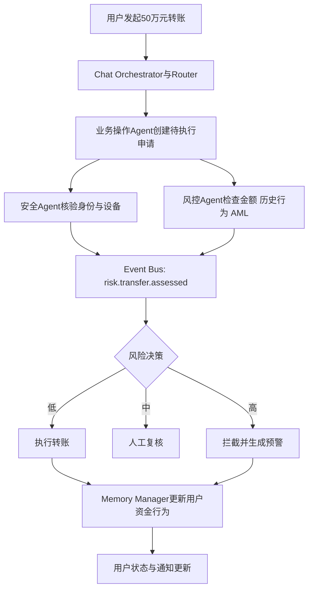

**Event 事件结构：**
```json
{"event_id":"uuid","event_type":"risk.transfer.assessed","source_agent":"risk","target_agent":"business_operation","customer_id":"C001","payload":{"amount":500000,"aml_hit":false,"decision":"manual_review","reasons":["金额超阈值"]},"timestamp":"ISO-8601"}
```

**Memory 更新：**Redis 保留待确认/待复核状态；MySQL Episodic 写申请、审核与操作日志；MySQL Profile 写动态风险标记；Milvus 写合规沟通摘要；Neo4j 建立 `Customer-TRANSFERRED_TO-Account` 与风险事件关联。

## 3. 风控发现风险，驱动投顾调整策略

**用户行为案例：**用户持仓集中度过高且账户回撤严重。

| Agent | 职责 |
|---|---|
| 风控 Agent | 识别集中度与回撤风险，产生风险事实 |
| 投顾 Agent | 收紧候选池、重新配置并解释原因 |
| 用户画像 Agent | 保存动态风险信号，不自动修改正式等级 |

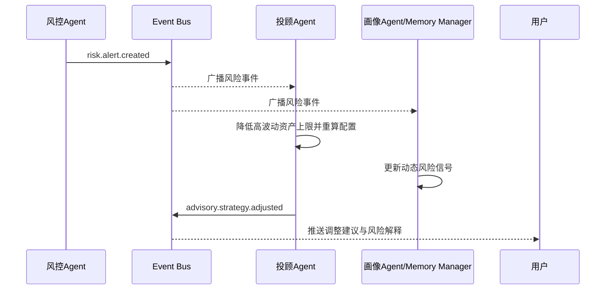

**Event 事件结构：**
```json
{"event_id":"uuid","event_type":"risk.alert.created","source_agent":"risk","target_agent":"advisor","customer_id":"C001","payload":{"alert_type":"concentration_drawdown","risk_level":"high","constraints":{"max_equity_ratio":0.45}},"timestamp":"ISO-8601"}
```

**Memory 更新：**Redis 刷新实时风险约束；MySQL Episodic 写预警与策略调整；MySQL Profile 写风险信号；Milvus 写风险解释语义摘要；Neo4j 关联客户、持仓、行业与预警节点。

## 4. 投顾推荐产品，风控审核

**用户行为案例：**投顾拟向稳健型客户推荐高收益理财产品。

| Agent | 职责 |
|---|---|
| 投顾 Agent | 生成候选产品、收益/风险理由和配置比例 |
| 风控 Agent | 校验风险等级、适当性、集中度与动态风险 |
| 合规 Agent | 校验必备风险揭示与销售边界 |

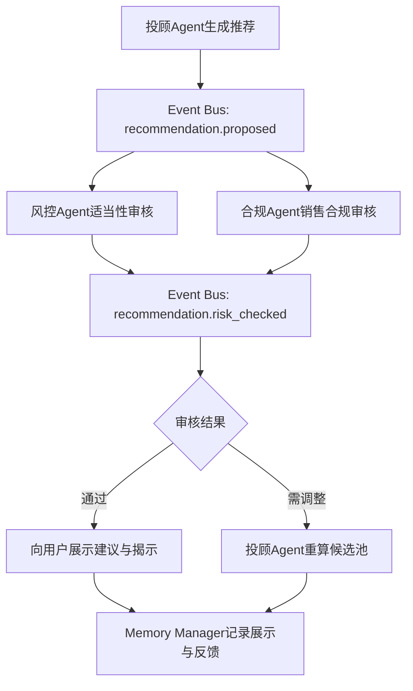

**Event 事件结构：**
```json
{"event_id":"uuid","event_type":"recommendation.risk_checked","source_agent":"risk","target_agent":"advisor","customer_id":"C001","payload":{"product_id":"P200","suitability":"restricted","max_ratio":0.1,"reason":"产品风险超过当前约束"},"timestamp":"ISO-8601"}
```

**Memory 更新：**Redis 缓存审核结论；MySQL Episodic 写推荐版本与审批轨迹；MySQL Profile 写已展示偏好；Milvus 写产品解释与风险揭示；Neo4j 记录客户—产品—适当性关系。

## 5. 投顾执行购买

**用户行为案例：**用户确认购买投顾推荐产品。

| Agent | 职责 |
|---|---|
| 投顾 Agent | 传递已审核的推荐与理由 |
| 业务操作 Agent | 处理确认、执行申购与审计 |
| 风控/合规 Agent | 在执行前复核关键约束 |

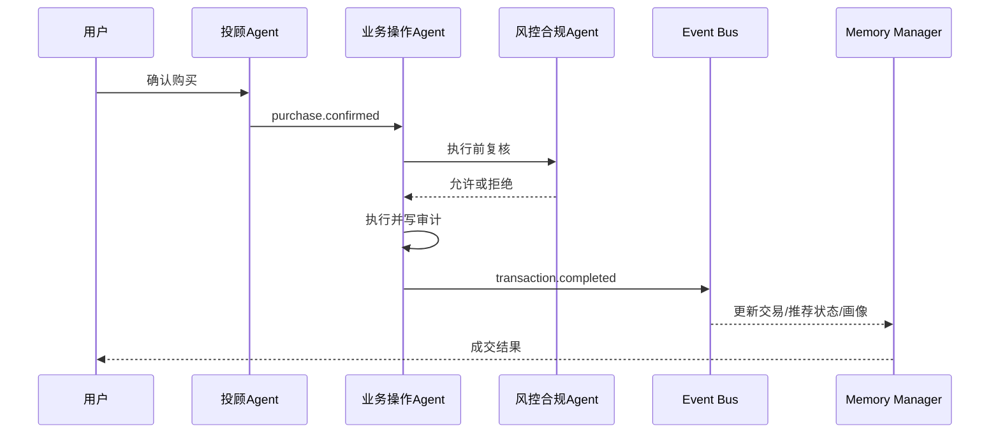

**Event 事件结构：**
```json
{"event_id":"uuid","event_type":"purchase.confirmed","source_agent":"advisor","target_agent":"business_operation","customer_id":"C001","payload":{"recommendation_id":"R001","product_id":"P200","amount":100000,"consent":true},"timestamp":"ISO-8601"}
```

**Memory 更新：**Redis 删除待确认单；MySQL Episodic 写同意与成交；MySQL Profile 写接受反馈；Milvus 写购买理由；Neo4j 更新客户持仓图谱。

## 6. 交易行为更新用户画像

**用户行为案例：**用户长期、持续购买新能源基金。

| Agent | 职责 |
|---|---|
| 业务操作 Agent | 产生可信交易事实 |
| 用户画像 Agent | 聚合行为，更新偏好与模式 |
| 投顾 Agent | 消费偏好信号改进后续候选池 |

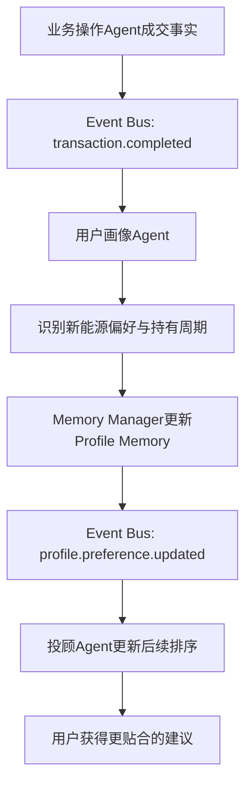

**Event 事件结构：**
```json
{"event_id":"uuid","event_type":"profile.preference.updated","source_agent":"profile","target_agent":"advisor","customer_id":"C001","payload":{"preferences":{"industry":"新能源","frequency":"长期定投"},"evidence_count":6},"timestamp":"ISO-8601"}
```

**Memory 更新：**Redis 失效画像缓存；MySQL Episodic 保留成交证据；MySQL Profile 更新偏好与置信度；Milvus 写行为摘要；Neo4j 增强客户—行业—产品偏好关系。

## 7. 数据分析发现异常交易

**用户行为案例：**系统发现用户交易频率突然增加，且存在追涨杀跌模式。

| Agent | 职责 |
|---|---|
| 数据分析 Agent | 识别频率、金额、收益与行为异常 |
| 风控 Agent | 将结构化洞察转为可解释规则评估 |
| 客服/画像 Agent | 记录服务提示与短期行为信号 |

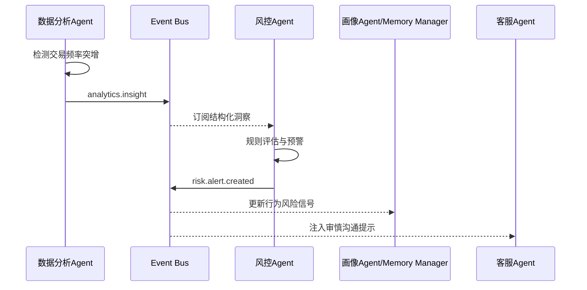

**Event 事件结构：**
```json
{"event_id":"uuid","event_type":"analytics.insight","source_agent":"analytics","target_agent":"risk","customer_id":"C001","payload":{"insight_type":"trading_frequency","window_days":7,"count":18,"evidence":"超过客户基线3倍"},"timestamp":"ISO-8601"}
```

**Memory 更新：**Redis 写短期交易风险；MySQL Episodic 存洞察证据和预警；MySQL Profile 存行为信号；Milvus 存分析解释；Neo4j 添加异常模式关联。

## 8. 数据分析优化投资组合

**用户行为案例：**发现用户资产集中在单一行业，现金比例不足。

| Agent | 职责 |
|---|---|
| 数据分析 Agent | 计算集中度、流动性与回撤贡献 |
| 投顾 Agent | 生成再平衡方案和替代产品 |
| 风控 Agent | 审核调整后适当性与比例 |

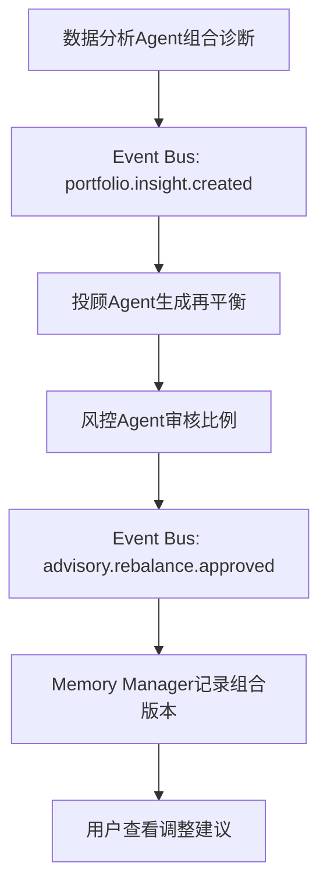

**Event 事件结构：**
```json
{"event_id":"uuid","event_type":"portfolio.insight.created","source_agent":"analytics","target_agent":"advisor","customer_id":"C001","payload":{"concentration":0.62,"liquidity_gap":true,"suggestion":"降低单一行业暴露"},"timestamp":"ISO-8601"}
```

**Memory 更新：**Redis 缓存最新组合诊断；MySQL Episodic 写分析版本；MySQL Profile 写配置偏好；Milvus 写诊断语义；Neo4j 更新持仓与行业暴露关系。

## 9. 市场事件广播

**用户行为案例：**重大政策变化影响某类理财产品和行业估值。

| Agent | 职责 |
|---|---|
| 市场 Agent | 解读行情、新闻和政策事件，形成可验证影响标签 |
| 风控/投顾/客服/画像 Agent | 分别调整约束、策略、话术与关注状态 |
| 合规 Agent | 判断对外沟通和销售材料是否需更新 |

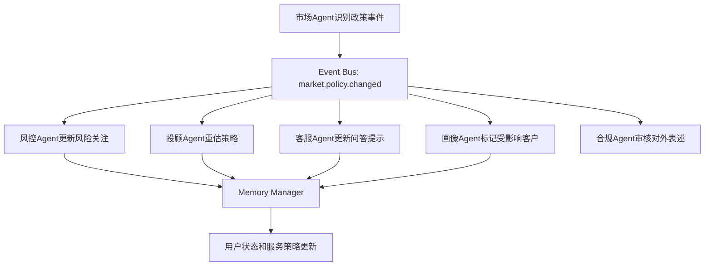

**Event 事件结构：**
```json
{"event_id":"uuid","event_type":"market.policy.changed","source_agent":"market","target_agent":"all_subscribers","customer_id":"","payload":{"policy_id":"POL-2026-01","affected_industries":["新能源"],"impact":"elevated_volatility"},"timestamp":"ISO-8601"}
```

**Memory 更新：**Redis 发布短期市场上下文；MySQL Episodic 写事件与影响范围；MySQL Profile 写受影响关注标签；Milvus 存政策原文/摘要；Neo4j 连接政策、行业、产品和客户。

## 10. 用户画像变化驱动投顾调整

**用户行为案例：**用户资产显著增加，客户等级与流动性需求变化。

| Agent | 职责 |
|---|---|
| 用户画像 Agent | 维护资产、等级、偏好和证据 |
| 投顾 Agent | 据新画像更新策略与服务层级 |
| 合规 Agent | 审核高净值产品准入与披露 |

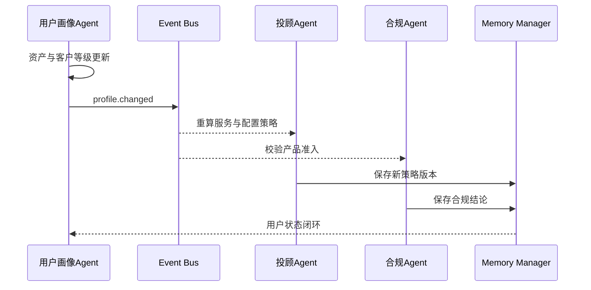

**Event 事件结构：**
```json
{"event_id":"uuid","event_type":"profile.changed","source_agent":"profile","target_agent":"advisor","customer_id":"C001","payload":{"aum":3000000,"customer_tier":"high_net_worth","changed_fields":["aum","tier"]},"timestamp":"ISO-8601"}
```

**Memory 更新：**Redis 失效旧画像；MySQL Episodic 写变更证据；MySQL Profile 更新等级/资产；Milvus 写客户摘要；Neo4j 更新客户层级与产品准入关系。

## 11. 客服识别用户情绪

**用户行为案例：**“最近亏损太大，不想投资了。”

| Agent | 职责 |
|---|---|
| 客服 Agent | 识别恐惧/负面情绪，给出审慎沟通 |
| 用户画像 Agent | 写入带 TTL 的情绪信号与证据 |
| 投顾 Agent | 在后续建议中降低激进表达并强化波动说明 |

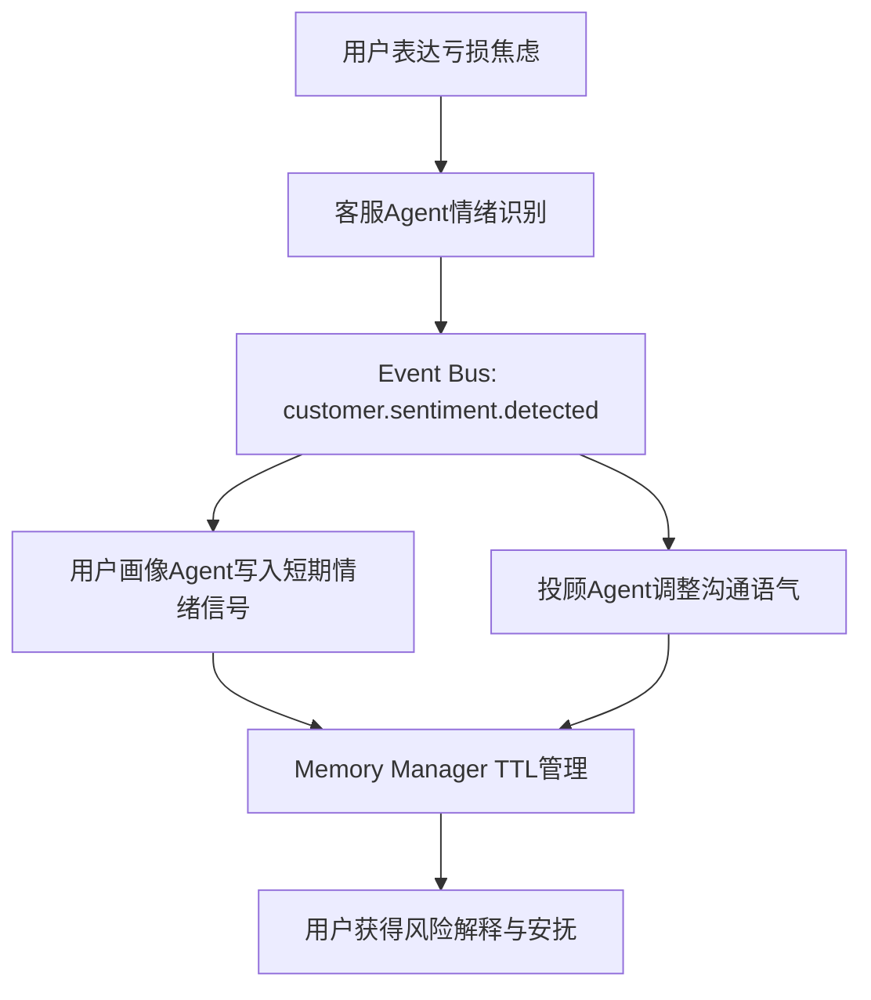

**Event 事件结构：**
```json
{"event_id":"uuid","event_type":"customer.sentiment.detected","source_agent":"customer_service","target_agent":"profile","customer_id":"C001","payload":{"sentiment":"high_distress","evidence":"亏损太大，不想投资","ttl_hours":72},"timestamp":"ISO-8601"}
```

**Memory 更新：**Redis 保存会话和短期情绪 TTL；MySQL Episodic 写服务证据；MySQL Profile 写非正式情绪信号；Milvus 写脱敏会话摘要；Neo4j 可选关联客户与服务事件，不改变正式风险等级。

## 12. 合规销售审核

**用户行为案例：**顾问拟向客户销售金融产品。

| Agent | 职责 |
|---|---|
| 投顾 Agent | 提交产品、客群、文案和推荐理由 |
| 合规 Agent | 审核宣传合规、风险提示、适当性和准入 |
| 风控 Agent | 复核动态风险与集中度约束 |

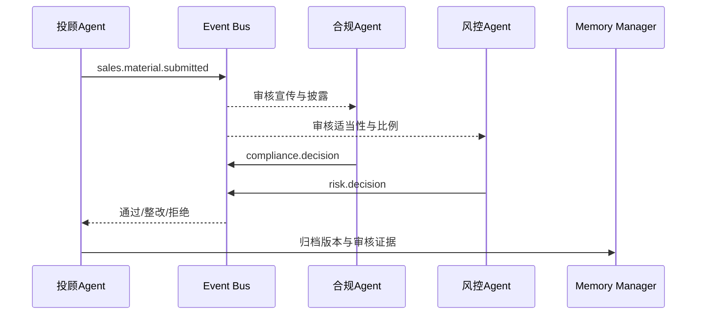

**Event 事件结构：**
```json
{"event_id":"uuid","event_type":"compliance.decision","source_agent":"compliance","target_agent":"advisor","customer_id":"C001","payload":{"product_id":"P200","decision":"revise","issues":["风险提示不充分"]},"timestamp":"ISO-8601"}
```

**Memory 更新：**Redis 缓存当前审核状态；MySQL Episodic 写材料版本/审批；MySQL Profile 写准入限制；Milvus 存合规条款与材料摘要；Neo4j 关联产品、规则、客户层级与审批记录。

## 13. 账户安全保护

**用户行为案例：**用户异地登录并尝试修改收款账户。

| Agent | 职责 |
|---|---|
| 安全 Agent | 检测登录地点、设备、身份和账户异常 |
| 风控 Agent | 将安全风险映射为资金操作限制与预警 |
| 客服 Agent | 承担人工核验和用户通知 |

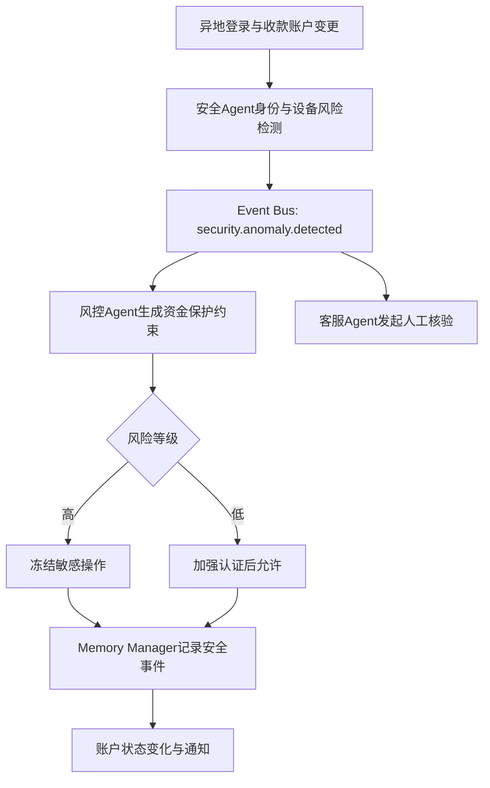

**Event 事件结构：**
```json
{"event_id":"uuid","event_type":"security.anomaly.detected","source_agent":"security","target_agent":"risk","customer_id":"C001","payload":{"anomaly":"new_location_and_payee_change","device_trust":"low","action":"freeze_sensitive_operation"},"timestamp":"ISO-8601"}
```

**Memory 更新：**Redis 写临时会话/冻结状态；MySQL Episodic 写安全审计；MySQL Profile 写安全风险标记；Milvus 写核验摘要；Neo4j 更新账户、设备、收款方与风险事件关系。

## 14. 客户投诉闭环

**用户行为案例：**“为什么推荐产品亏损？”

| Agent | 职责 |
|---|---|
| 客服 Agent | 受理投诉、识别情绪、创建工单 |
| 投顾 Agent | 回溯推荐依据、披露与执行记录 |
| 风控 Agent | 核验适当性、风险提示与异常行为 |
| 用户画像 Agent | 记录投诉和服务偏好，防止重复伤害 |
| 合规 Agent | 审核结论与对客表述 |

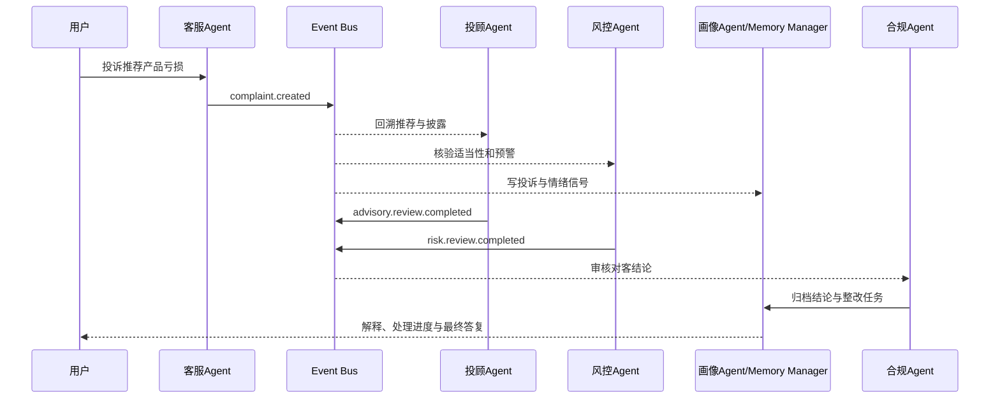

**Event 事件结构：**
```json
{"event_id":"uuid","event_type":"complaint.created","source_agent":"customer_service","target_agent":"advisor,risk,profile,compliance","customer_id":"C001","payload":{"complaint_type":"recommendation_loss","product_id":"P200","case_id":"WO-001","sentiment":"negative"},"timestamp":"ISO-8601"}
```

**Memory 更新：**Redis 写工单进度与服务上下文；MySQL Episodic 写投诉、回溯、答复和整改；MySQL Profile 写投诉偏好/服务限制；Milvus 写脱敏投诉摘要与知识复用材料；Neo4j 建立客户—推荐—产品—工单—规则的追溯图谱。

## 统一落地要点

1. **同步只用于必要闸门**：身份验证、适当性、额度、AML、二次确认和资金执行必须同步返回决定；跨 Agent 影响一律以事件异步广播。
2. **先事实、后事件**：交易、预警、审批、工单先与 Outbox 同事务落 MySQL，Relay 再投递 Redis Stream/Kafka，避免“已发消息但事实未落库”。
3. **Memory 不是日志副本**：Redis 解决短期会话与即时约束；MySQL 保存可审计事实和画像；Milvus 服务语义回忆；Neo4j 服务关系追溯与关联推理。
4. **用户状态分层**：正式风险等级、动态风险约束、情绪/市场/行为信号必须分别存储和治理，避免非受控信号直接改变合规等级。
