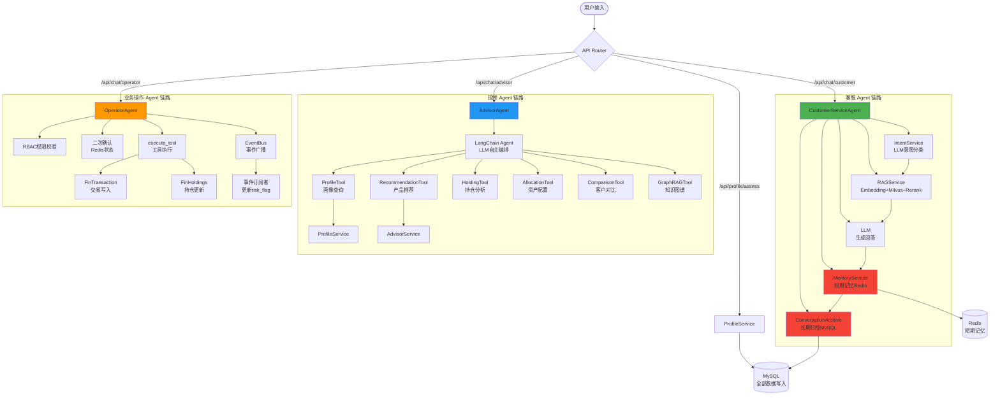
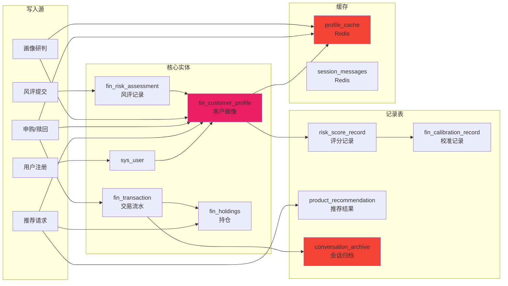
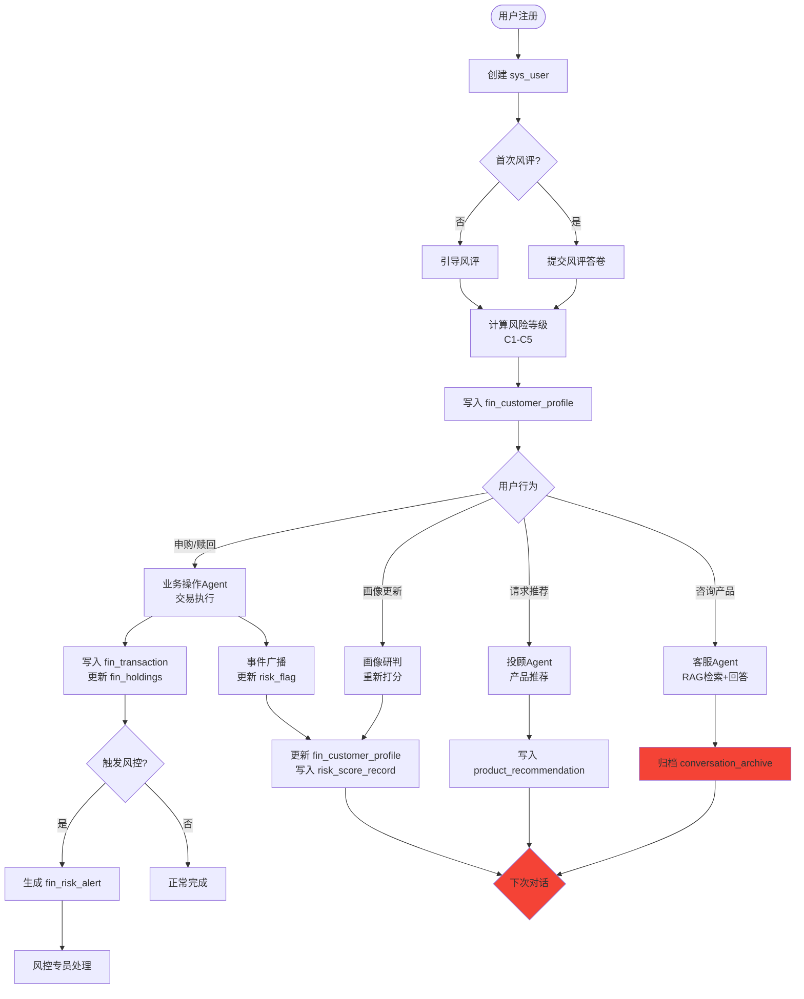
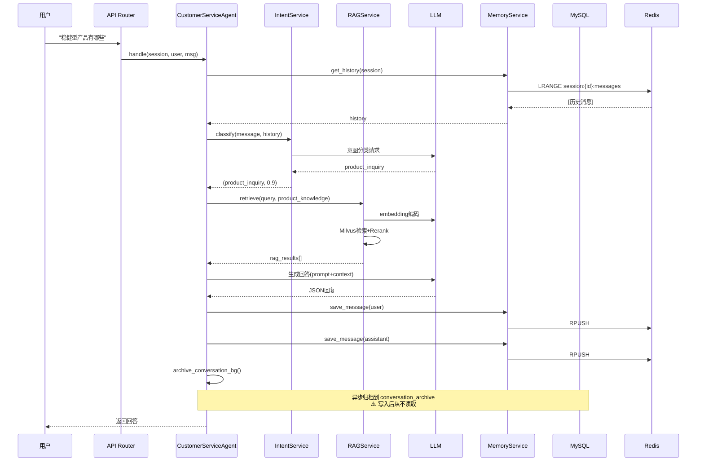

# 智能财富管家系统 — 架构复盘与生产级验收报告

> 审计日期：2026-07-24
> 审计视角：AI Agent 架构师 / 系统架构审计 / 技术负责人
> 审计目标：验证 Agent 系统是否形成真实业务闭环，能否支撑上线

---

## 一、执行摘要

| 维度 | 评级 | 说明 |
|------|------|------|
| 核心业务闭环 | ⚠️ 部分达标 | 单轮对话、单业务流转通；跨轮/跨 session 记忆断裂 |
| 数据一致性 | ⚠️ 中等 | 无 FK 约束，归档双写可能重复，事件总线有盲区 |
| 记忆系统 | ❌ 不达标 | 长期记忆只写不读，跨 session 完全失忆 |
| Agent 通信 | ⚠️ 基础达标 | 事件总线仅 1/3 消费，无直接 Agent 调用 |
| 容错与降级 | ❌ 不达标 | LLM/Embedding 失败直接 500，无优雅降级 |
| 生产就绪度 | ❌ 不达标 | 需修复记忆闭环 + 容错后才能上线 |

**结论：当前系统是一个"功能原型"而非"生产系统"。** 单条业务链路（申购、风评、NL2SQL、单轮客服）已打通，但**多轮对话失忆、跨 session 失忆、LLM 单点故障 = 500** 这三个问题不解决，真实用户无法使用。

---

## 二、端到端业务流程追踪

### 2.1 客户咨询闭环（客服 Agent）

```
用户输入"稳健型产品有哪些"
    │
    ▼
┌─────────────────────────────────┐
│ ① CustomerServiceAgent.handle() │
│   - memory.get_history(session) │ ← 短期记忆召回（仅当前 session）
│   - ❌ 不召回历史 session       │
└────────────┬────────────────────┘
             │
             ▼
┌─────────────────────────────────┐
│ ② IntentService.classify()      │
│   - LLM 调用（意图分类）         │
│   - 输出: product_inquiry        │
│   - ⚠️ LLM 失败→降级 chitchat   │
└────────────┬────────────────────┘
             │
             ▼
┌─────────────────────────────────┐
│ ③ RAGService.retrieve()         │
│   - embedding_tool.encode()      │ ← ⚠️ 失败=500（本次修复前）
│   - Milvus 语义检索              │
│   - reranker 精排               │
│   - ❌ embedding 无降级方案      │
└────────────┬────────────────────┘
             │
             ▼
┌─────────────────────────────────┐
│ ④ _generate_with_context()      │
│   - LLM 生成回答                 │
│   - JSON 解析 + 兜底             │
│   - ✅ 有 try/except 兜底        │
└────────────┬────────────────────┘
             │
             ▼
┌─────────────────────────────────┐
│ ⑤ 后处理                        │
│   - safety.check_content()       │
│   - memory.save_message() x2     │ ← 短期记忆写入 Redis
│   - archive_conversation_bg()    │ ← 异步归档 MySQL
│   - ❌ 归档后从不读取             │
└────────────┬────────────────────┘
             │
             ▼
        返回用户 ✅
```

**闭环判定：⚠️ 半闭环**
- ✅ 单轮问答完整
- ✅ 短期记忆（同 session 多轮）有效
- ❌ **跨 session 完全失忆**——用户第二天来，Agent 不知道他昨天说过自己是退休教师
- ❌ 长期归档只写不读，等于没存

---

### 2.2 投顾咨询闭环（Advisor Agent）

```
用户输入"推荐几款产品给客户张三"
    │
    ▼
┌──────────────────────────────────┐
│ ① AdvisorAgent.execute()         │
│   - LangChain create_agent        │
│   - LLM 自主决定工具调用链         │
│   - recursion_limit=6, timeout=90s│
└────────────┬─────────────────────┘
             │
             ▼ LLM 决策调用工具链
┌──────────────────────────────────┐
│ ② 工具调用（按需组合）             │
│   profile_tool → ProfileService   │ → 读/写 FinCustomerProfile
│   recommend_products → AdvisorSvc │ → 写 ProductRecommendation
│   analysis_holdings → HoldingTool │ → 读 FinHoldings + Neo4j
│   compare_customers              │ → 读画像对比
│   asset_allocation               │ → 读风险等级
│   graphrag_search                │ → Neo4j + Milvus
└────────────┬─────────────────────┘
             │
             ▼
┌──────────────────────────────────┐
│ ③ 结果组装                        │
│   - _extract_reply()              │
│   - _extract_tool_result()        │
│   - 返回 recommendations[]        │
└────────────┬─────────────────────┘
             │
             ▼
        返回用户 ✅（但无记忆写入）
```

**闭环判定：⚠️ 半闭环**
- ✅ 多工具编排、LLM 自主决策
- ✅ 画像更新写入 DB
- ❌ **无 session 记忆**——AdvisorAgent 不调用 MemoryService，多轮对话无上下文
- ❌ 推荐结果写入 ProductRecommendation 但后续无消费

---

### 2.3 业务操作闭环（Operator Agent）

```
用户输入"帮客户张三申购XX基金1万元"
    │
    ▼
┌──────────────────────────────────┐
│ ① operator_chat()                 │
│   - 检查待确认操作（Redis）         │
│   - LLM Function Calling 选工具    │
│   - 提取参数（customer_name→ID）   │
└────────────┬─────────────────────┘
             │
             ▼
┌──────────────────────────────────┐
│ ② RBAC 权限校验                   │
│   - check_permission(role, action)│
│   - ❌ 无权限→返回提示            │
└────────────┬─────────────────────┘
             │
             ▼
┌──────────────────────────────────┐
│ ③ 二次确认（大额操作）             │
│   - needs_confirmation() > 阈值    │
│   - Redis 保存待确认状态            │
│   - 用户回复"确认"→执行            │
└────────────┬─────────────────────┘
             │
             ▼
┌──────────────────────────────────┐
│ ④ execute_tool()                  │
│   - resolve_customer_id/name      │
│   - 新 db session 执行操作         │
│   - purchase_product/redeem/...   │
│   - 写 FinTransaction + FinHoldings│
└────────────┬─────────────────────┘
             │
             ▼
┌──────────────────────────────────┐
│ ⑤ 事件广播 ✅                     │
│   - publish_operation_event()     │
│   - → event:risk_alert            │
│   - → 订阅者更新 risk_flag        │
│   - → 清除画像缓存                │
└────────────┬─────────────────────┘
             │
             ▼
        返回用户 ✅
```

**闭环判定：✅ 最完整的一条链路**
- ✅ 权限校验 + 二次确认
- ✅ 交易写入 + 持仓更新
- ✅ 事件广播 → 画像 risk_flag 更新 → 后续推荐降权
- ✅ 会话记忆（短期）
- ⚠️ 跨 session 仍失忆（但业务操作影响面有限）

---

### 2.4 画像研判闭环

```
触发：POST /api/profile/{id}/assess
    │
    ▼
┌──────────────────────────────────┐
│ ① ProfileService.assess()         │
│   - 收集客户全量数据               │
│   - 四维度打分                     │
│   - 熔断检查                       │
│   - 双轨校准                       │
└────────────┬─────────────────────┘
             │
             ▼
┌──────────────────────────────────┐
│ ② 写入（全部 ✅）                  │
│   - FinCustomerProfile (更新)      │
│   - RiskScoreRecord (新增)         │
│   - FinCalibrationRecord (新增)    │
│   - ProfileCache (失效)            │
└────────────┬─────────────────────┘
             │
             ▼
        返回结果 ✅
```

**闭环判定：✅ 数据写入完整**
- ✅ 四张表联动写入
- ✅ 缓存失效保证一致性

---

## 三、记忆系统审计（核心缺陷）

### 3.1 记忆四层架构现状

```
┌─────────────────────────────────────────────────────────┐
│                    记忆系统现状                           │
├──────────────┬──────────────┬──────────────┬────────────┤
│   短期记忆    │   中期记忆    │   长期记忆    │  语义记忆   │
│  (Session)   │  (Profile)   │  (Archive)   │ (Knowlege) │
├──────────────┼──────────────┼──────────────┼────────────┤
│ Redis LIST   │ Redis STRING │ MySQL        │ Milvus     │
│ session:{id} │ profile:{id} │ conversation │ 知识库集合  │
│ :messages    │              │ _archive     │            │
├──────────────┼──────────────┼──────────────┼────────────┤
│ ✅ 写入      │ ✅ 写入      │ ✅ 写入      │ ✅ 写入    │
│ ✅ 读取      │ ✅ 读取      │ ❌ 不读取    │ ✅ RAG检索 │
│ TTL 30min    │ TTL 7day     │ 永久         │ 永久       │
├──────────────┼──────────────┼────────────┴────────────┤
│ 同 session   │ 画像缓存     │     ⚠️ 长期记忆是"黑洞"：   │
│ 多轮有效     │ 跨 session   │     只写不读，写入即丢失     │
│ 跨 session❌ │ 有效 ✅     │                              │
└──────────────┴──────────────┴─────────────────────────────┘
```

### 3.2 记忆闭环验证结果

| 场景 | 预期 | 实际 | 状态 |
|------|------|------|------|
| 同 session 第 2 轮引用第 1 轮 | 能引用 | 能引用 | ✅ |
| 新 session 召回上一 session 信息 | 应召回 | 不召回 | ❌ |
| 客服 Agent 知道用户历史偏好 | 应知道 | 不知道 | ❌ |
| 投顾 Agent 有会话记忆 | 应有 | 没有 | ❌ |
| 历史评分记录能被 Agent 使用 | 应使用 | 不使用 | ❌ |

### 3.3 根因

1. **长期记忆（conversation_archive）无读取路径** — `CustomerServiceAgent.handle()` 只调用 `memory.get_history(session_id)` 读 Redis，从不查 MySQL 归档
2. **无跨 session 召回机制** — 没有"用户画像摘要→注入 prompt"的链路
3. **AdvisorAgent 不用 MemoryService** — 完全没有 session 记忆
4. **风险评分历史 `get_rating_history()` 存在但无调用方** — 写了没人读

---

## 四、Agent 通信机制审计

### 4.1 通信方式

```
                    ┌─────────────────┐
                    │   Redis Pub/Sub  │
                    │  事件总线         │
                    └────────┬────────┘
                             │
        ┌────────────────────┼────────────────────┐
        │                    │                    │
   ┌────▼────┐         ┌────▼────┐         ┌────▼────┐
   │event:   │         │event:   │         │event:   │
   │risk_alert│        │profile_ │         │work_    │
   │         │         │update   │         │order_   │
   │         │         │         │         │change   │
   └────┬────┘         └────┬────┘         └────┬────┘
        │                    │                    │
   ✅ 有消费者          ❌ 无消费者          ❌ 无消费者
   (更新risk_flag)     (定义了但未启动)      (无)
```

### 4.2 Agent 通信矩阵

| 生产者 → 消费者 | 通道 | 状态 |
|----------------|------|------|
| OperatorAgent → EventBus(risk_alert) | Redis Pub/Sub | ✅ 有消费者更新 risk_flag |
| OperatorAgent → EventBus(profile_update) | Redis Pub/Sub | ❌ 无消费者 |
| OperatorAgent → EventBus(work_order_change) | Redis Pub/Sub | ❌ 无消费者 |
| ProfileService → (画像更新) | 直接 DB 写入 | ⚠️ 无事件通知 |
| 任意 Agent → 任意 Agent | 直接调用 | ❌ 不存在 |

### 4.3 问题

- **事件总线覆盖率 33%** — 3 个事件类型只有 1 个被消费
- **无直接 Agent 间调用** — Agent 之间完全独立，无法协作（如客服 Agent 无法请求投顾 Agent 推荐产品）
- **AdvisorService.subscribe_risk_alerts() 已定义但未启动** — 启动链路遗漏

---

## 五、数据库一致性审计

### 5.1 关键风险

| 风险 | 严重度 | 说明 |
|------|--------|------|
| 无 FK 约束 | 🔴 高 | 所有关联都是软关联，删用户不会级联 |
| 归档双写 | 🟡 中 | SessionMemory.archive() 和 MemoryService.archive_conversation() 可能重复写入 |
| get_db() 自动提交 | 🟡 中 | 成功即 commit，partial work 难以回滚 |
| 无乐观锁 | 🟡 中 | 画像并发更新可能丢数据 |
| 事件无持久化 | 🟡 中 | Redis Pub/Sub fire-and-forget，订阅者挂了事件丢失 |

### 5.2 数据血缘（关键链路）

```
用户注册 → sys_user
    │
    ▼
风评提交 → fin_risk_assessment → fin_customer_profile(risk_level, risk_score)
    │
    ▼
画像研判 → fin_customer_profile(更新) + risk_score_record(新增)
         → fin_calibration_record(新增) + profile_cache(失效)
    │
    ▼
申购操作 → fin_transaction(新增) + fin_holdings(更新/新增)
         → event:risk_alert → fin_customer_profile.risk_flag(更新)
         → profile_cache(失效)
    │
    ▼
推荐请求 → product_recommendation(新增)
         → 读取 fin_customer_profile.risk_level
         → 读取 fin_holdings
```

---

## 六、生产级问题清单（按严重度排序）

### 🔴 P0 — 阻断上线

| # | 问题 | 影响 | 修复方案 |
|---|------|------|----------|
| 1 | 跨 session 记忆断裂 | 用户每次对话都是全新体验，无法积累 | 增加"用户画像摘要→prompt 注入"链路 |
| 2 | LLM/Embedding 失败 = 500 | 智能客服完全不可用 | embedding 降级（关键词检索或直接回复） |
| 3 | AdvisorAgent 无 session 记忆 | 投顾无法多轮对话 | 接入 MemoryService |

### 🟡 P1 — 影响体验

| # | 问题 | 影响 | 修复方案 |
|---|------|------|----------|
| 4 | 事件总线 2/3 未消费 | 画像更新/工单变更无联动 | 启动所有订阅者 |
| 5 | 长期记忆只写不读 | 归档数据浪费 | 增加历史检索召回 |
| 6 | 3 个 Agent 孤立无路由 | ProfileAgent/RecommendationAgent/ExplanationAgent 无法被调用 | 注册路由或删除 |
| 7 | 无 FK 约束 | 数据孤儿风险 | 应用层兜底 + 定期清理 |

### 🟢 P2 — 优化项

| # | 问题 | 影响 |
|---|------|------|
| 8 | embedding 与 LLM 同一单点 | 一个挂全挂 |
| 9 | 无 Agent 调用链追踪 | 排查困难 |
| 10 | Milvus ORM 风格 API 弃用警告 | 未来版本不兼容 |

---

## 七、架构图表

### 7.1 Agent 链路追踪图



### 7.2 数据血缘图



### 7.3 用户生命周期数据流图



### 7.4 Agent 通信时序图



### 7.5 数据库 ER 闭环图

```mermaid
erDiagram
    SYS_USER ||--o{ FIN_CUSTOMER_PROFILE : "has"
    SYS_USER ||--o{ FIN_HOLDINGS : "holds"
    SYS_USER ||--o{ FIN_TRANSACTION : "makes"
    SYS_USER ||--o{ RISK_ASSESSMENT : "submits"
    SYS_USER ||--o{ CONVERSATION_ARCHIVE : "generates"
    SYS_USER ||--o{ RISK_SCORE_RECORD : "rated_by"
    SYS_USER ||--o{ PRODUCT_RECOMMENDATION : "receives"
    SYS_USER ||--o{ BIZ_WORK_ORDER : "submits"
    SYS_USER ||--o{ FIN_RISK_ALERT : "triggers"
    SYS_USER ||--o{ CUSTOMER_TAG : "tagged"
    
    FIN_PRODUCT ||--o{ FIN_HOLDINGS : "held_as"
    FIN_PRODUCT ||--o{ FIN_TRANSACTION : "transacted_in"
    FIN_PRODUCT ||--o{ PRODUCT_RECOMMENDATION : "recommended"
    
    FIN_CUSTOMER_PROFILE ||--o{ FIN_CALIBRATION_RECORD : "calibrated_by"
    
    SYS_USER {
        bigint id PK
        varchar username
        varchar user_type
        varchar employee_role
        varchar customer_level
        decimal balance
    }
    
    FIN_CUSTOMER_PROFILE {
        bigint id PK
        bigint customer_id FK
        varchar risk_level
        int risk_score
        decimal confidence_score
        json profile_json
        varchar risk_flag
    }
    
    FIN_TRANSACTION {
        bigint id PK
        varchar transaction_no
        bigint customer_id FK
               bigint product_id FK
        varchar transaction_type
        decimal amount
        decimal shares
        varchar status
    }

    FIN_HOLDINGS {
        bigint id PK
        bigint customer_id FK
        bigint product_id FK
        decimal shares
        decimal cost_amount
        decimal current_value
    }

    RISK_ASSESSMENT {
        bigint id PK
        bigint customer_id FK
        date assessment_date
        int total_score
        varchar risk_level
        json answers
        date valid_until
    }

    RISK_SCORE_RECORD {
        bigint id PK
        bigint customer_id FK
        datetime rating_date
        decimal total_score
        varchar risk_level
        json detail_json
        varchar trigger_type
    }

    PRODUCT_RECOMMENDATION {
        bigint id PK
        bigint customer_id FK
        varchar product_code
        decimal match_score
        text reasoning
    }

    CONVERSATION_ARCHIVE {
        bigint id PK
        varchar session_id
        bigint user_id FK
        varchar agent_type
        varchar role
        text content
        json tool_calls
    }

    FIN_RISK_ALERT {
        bigint id PK
        bigint customer_id FK
        varchar alert_level
        varchar status
        bigint handler_id FK
    }

    BIZ_WORK_ORDER {
        bigint id PK
        varchar work_order_no
        bigint customer_id FK
        bigint submitter_id FK
        varchar status
    }
```



### 7.6 目标修复架构图（记忆闭环补齐后）

```mermaid
flowchart TD
    User([用户输入]) --> Router{API Router}

    Router -->|/api/chat/customer| CA[CustomerServiceAgent]
    Router -->|/api/chat/advisor| AA[AdvisorAgent]

    subgraph 修复后：完整记忆闭环
        CA --> SM[短期记忆\nRedis 同session]
        CA --> PROFILE[画像摘要\n从 FinCustomerProfile]
        CA --> HIST[历史偏好\n从 conversation_archive 检索]
        CA --> LONG[长期记忆\n跨session召回]

        AA --> SM2[短期记忆\n✅ 新增接入]
        AA --> PROFILE2[画像摘要\n已有]
        AA --> HIST2[历史偏好\n✅ 新增检索]
    end

    subgraph 修复后：Agent 协作
        CA -->|产品推荐请求| AA
        AA -->|需要操作| OA[OperatorAgent]
        OA -->|风险事件更新| EB[EventBus]
        EB -->|画像降权| PROFILE
    end

    subgraph 修复后：容错降级
        CA -->|Embedding失败| FALLBACK1[关键词检索\n或兜底回复]
        CA -->|LLM失败| FALLBACK2[规则兜底\n不返回500]
    end

    SM --> RD[(Redis)]
    PROFILE --> DB[(MySQL)]
    HIST --> DB
    LONG --> DB

    style CA fill:#4CAF50
    style AA fill:#2196F3
    style LONG fill:#4CAF50
    style HIST fill:#4CAF50
    style FALLBACK1 fill:#4CAF50
    style FALLBACK2 fill:#4CAF50
```

---

## 八、修复优先级路线图

### 第一阶段（1-2 天）— 记忆闭环

1. **新增 `UserMemoryRecallService`**：在 Agent 调用链中注入用户画像摘要 + 历史偏好
2. **客服 Agent 增加长期召回**：`handle()` 中增加从 `conversation_archive` 检索用户历史偏好
3. **AdvisorAgent 接入 MemoryService**：多轮对话支持

### 第二阶段（1 天）— 容错降级

4. **Embedding 失败降级**：RAGService.retrieve() 中 catch embedding 异常，降级为关键词匹配或返回兜底
5. **事件总线补全**：启动 `AdvisorService.subscribe_risk_alerts()`，补齐 profile_update / work_order_change 消费者

### 第三阶段（2 天）— 生产加固

6. **注册 3 个孤立 Agent 路由**（或删除冗余代码）
7. **增加 Agent 调用链追踪**（trace_id 透传）
8. **数据库 FK 约束 + 定期孤儿清理**

---

## 九、总结

| 维度 | 当前状态 | 目标状态 |
|------|----------|----------|
| 单轮业务 | ✅ 已通 | ✅ 保持 |
| 同 session 多轮 | ✅ 客服有 | ✅ 全部 Agent |
| 跨 session 记忆 | ❌ 断裂 | ✅ 画像+历史召回 |
| Agent 协作 | ❌ 无 | ✅ 客服→投顾→操作 |
| 事件总线 | ⚠️ 33% | ✅ 100% 消费 |
| LLM 容错 | ❌ 500 | ✅ 优雅降级 |
| 长期记忆 | ⚠️ 只写不读 | ✅ 读写闭环 |

**当前系统是一个功能完整的"原型"，核心单链路已验证可行。距离生产上线，最关键的 3 个修复是：记忆闭环、容错降级、Agent 协作。**
